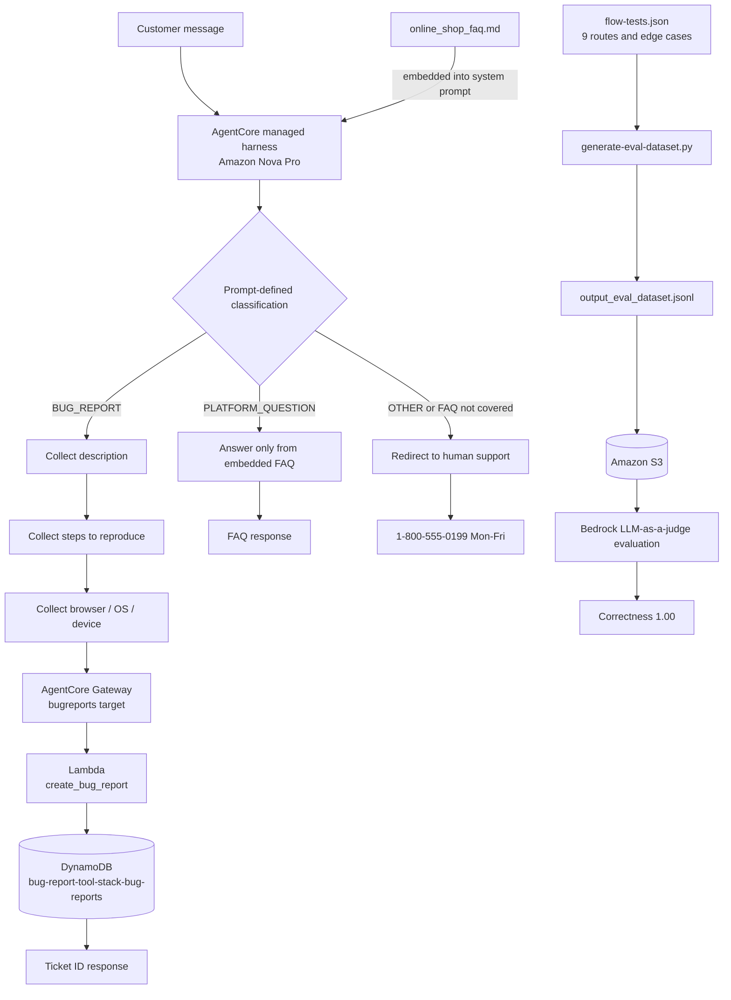

# Customer Support Chatbot — Full Route Diagram

The updated course uses an Amazon Bedrock AgentCore managed harness. Routing
is defined in `system_prompt.txt`; there are no separate Bedrock Flow nodes.

## Route definitions

| Route | Trigger | Result |
|---|---|---|
| `BUG_REPORT` | Specific website or app malfunction | Collect all three required fields, invoke the Gateway tool once, persist the ticket, and return its ID. |
| `PLATFORM_QUESTION` | Question explicitly covered by the embedded FAQ | Return a concise FAQ-grounded answer without inventing policy. |
| `OTHER` | Unrelated, unsupported, ambiguous, or injection request | Redirect to `1-800-555-0199 (Mon-Fri)`. |

This diagram is the AgentCore equivalent of the legacy Bedrock Flow diagram
requested by older rubric wording.
